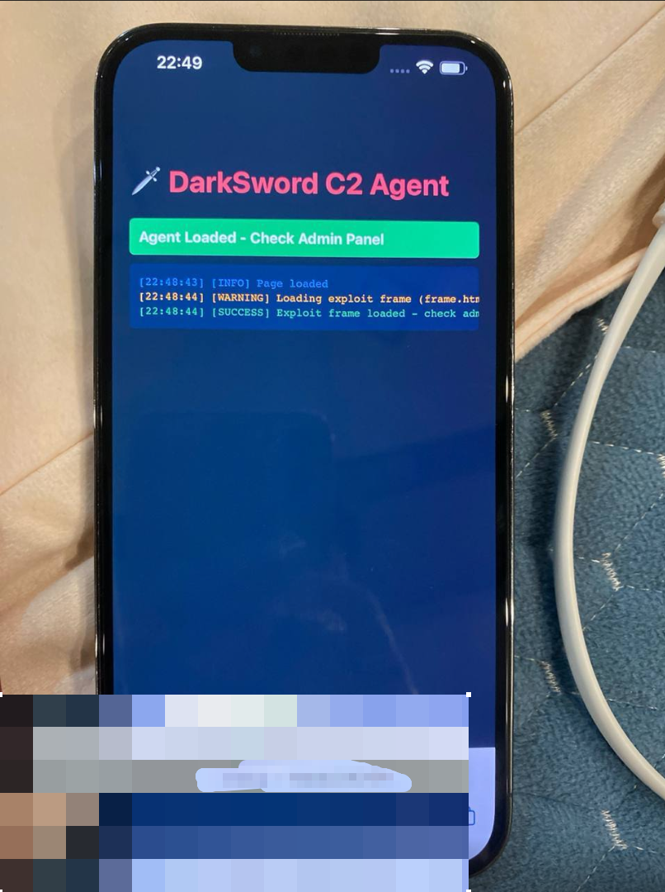
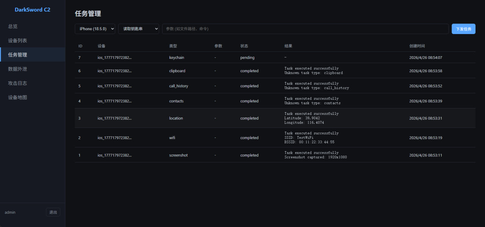
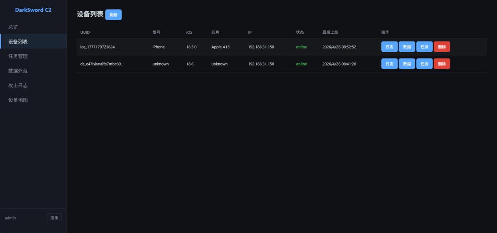
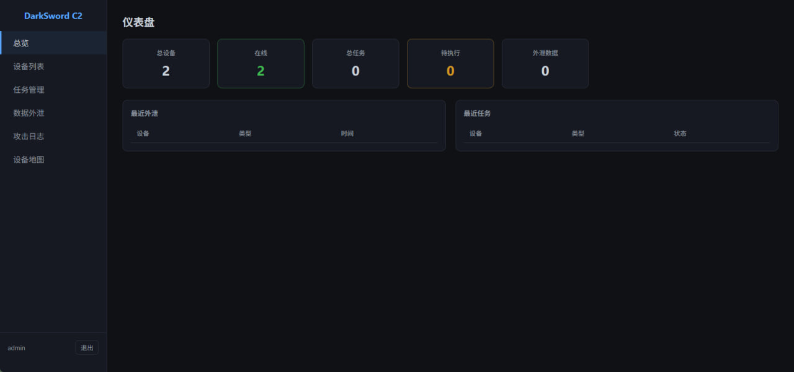
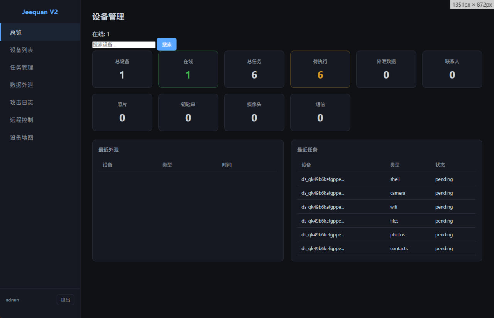
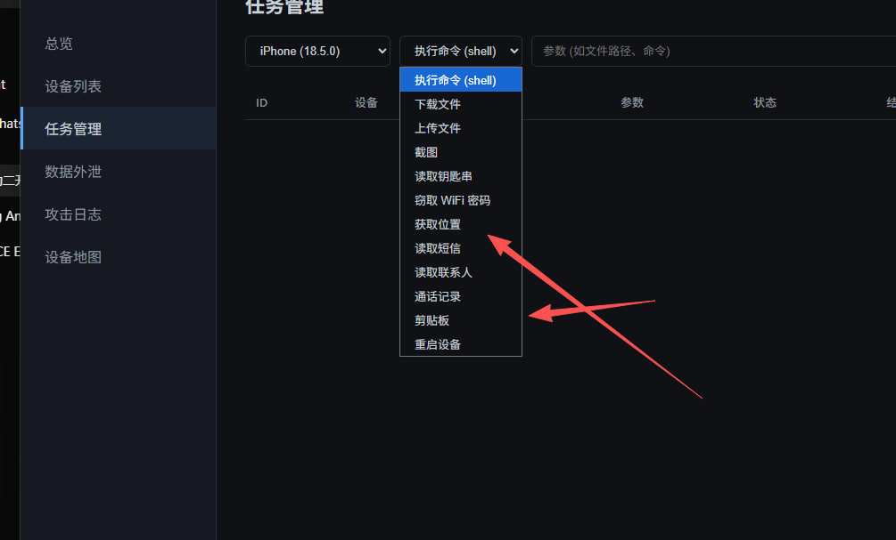
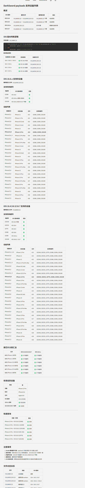

# DarkSword Pro 商业版本

2026年4月发布最新增强版本 + 完美商业后台

## 项目概述

DarkSword Pro 是业界领先的 iOS 安全研究漏洞利用框架，专为专业红队和安全研究团队设计。我们提供完整的 iOS 18.4 - 18.7 漏洞利用链，配合功能强大的商业级 C2 控制后台，为您的安全测试提供全方位支持。

## **获取完整项目**：**Telegram**：[https://t.me/Jeequan](https://t.me/Jeequan)   （不免费提供技术支持5000U）

> **声明**：本工具仅供授权的安全研究和渗透测试使用。

## 核心功能

### 漏洞利用模块

| 功能模块   | 支持版本         | 说明               |
| ---------- | ---------------- | ------------------ |
| WebKit RCE | iOS 18.4 / 18.6+ | 远程代码执行漏洞   |
| 沙箱逃逸   | iOS 18.4         | 绕过沙箱限制       |
| 权限提升   | iOS 18.4 - 18.7  | 内核级读写能力     |
| C2 通信    | 可配置           | 自定义命令控制信道 |

### C2 控制面板功能

| 功能模块 | 说明                                     |
| -------- | ---------------------------------------- |
| 设备管理 | 设备列表、在线状态监控、设备信息查看     |
| 任务管理 | 批量下发任务、任务状态追踪、任务历史记录 |
| 数据外泄 | 钥匙串读取、WiFi密码获取、通讯录提取     |
| 远程控制 | 截图、摄像头控制、文件管理、命令执行     |
| 位置追踪 | 获取设备实时位置、位置历史记录           |
| 信息收集 | 通话记录、短信内容、剪贴板数据           |
| 仪表盘   | 设备统计、任务概览、数据外泄记录         |
| 攻击日志 | 完整操作日志、攻击记录追踪               |
| 设备地图 | 设备地理位置可视化展示                   |

### 支持的 CVE

| 漏洞编号       | 目标版本  | 组件                  |
| -------------- | --------- | --------------------- |
| CVE-2025-31277 | iOS 18.4  | WebWorker JSC Exploit |
| CVE-2025-43529 | iOS 18.6+ | WebWorker JSC Exploit |

## 技术架构

### 攻击链流程

```
┌─────────────────────────────────────────────────────┐
│ 1. 着陆页 (Landing)                                │
│    - 隐藏 iframe 加载攻击页面                       │
└─────────────────────────────────────────────────────┘
                          ↓
┌─────────────────────────────────────────────────────┐
│ 2. 框架加载 (Frame)                                │
│    - 注入版本检测和模块加载器                       │
└─────────────────────────────────────────────────────┘
                          ↓
┌─────────────────────────────────────────────────────┐
│ 3. 版本适配 (Loader)                               │
│    - 自动识别 iOS 版本                             │
│    - 加载对应版本的 RCE 模块                      │
└─────────────────────────────────────────────────────┘
                          ↓
┌─────────────────────────────────────────────────────┐
│ 4. 远程代码执行 (RCE)                              │
│    - WebKit 漏洞利用                               │
│    - JavaScriptCore 执行环境                       │
└─────────────────────────────────────────────────────┘
                          ↓
┌─────────────────────────────────────────────────────┐
│ 5. 沙箱逃逸 (Sandbox Escape)                       │
│    - 绕过 iOS 沙箱安全限制                          │
└─────────────────────────────────────────────────────┘
                          ↓
┌─────────────────────────────────────────────────────┐
│ 6. 权限提升 (Privilege Escalation)                 │
│    - 内核级读写原语                                │
│    - ICMPv6 Socket 技术                            │
│    - IOSurface 物理内存映射                        │
└─────────────────────────────────────────────────────┘
                          ↓
┌─────────────────────────────────────────────────────┐
│ 7. 命令控制 (C2)                                  │
│    - 可自定义 C2 地址                              │
│    - 数据窃取和传输                                │
└─────────────────────────────────────────────────────┘
```

## 项目结构

darksword-final/
├── darksword/                    # Python 主模块 (后端核心)
│   ├── __init__.py
│   ├── api/                      # API 路由模块
│   │   ├── __init__.py
│   │   ├── admin.py              # 管理面板 API
│   │   ├── devices.py            # 设备管理 API
│   │   ├── postexploit.py        # 后渗透 API
│   │   ├── tasks.py              # 任务管理 API
│   │   ├── upload.py             # 文件上传 API
│   │   └── websocket.py          # WebSocket 实时通信
│   ├── static/                   # 前端静态文件
│   │   ├── app.js                # 前端应用逻辑
│   │   ├── index.html            # 管理面板主页
│   │   └── style.css             # 样式文件
│   ├── cli.py                    # CLI 命令入口
│   ├── config.py                 # 配置管理
│   ├── crud.py                   # 数据库 CRUD 操作
│   ├── database.py               # 数据库连接
│   ├── models.py                 # 数据模型定义
│   ├── payloads.py               # Payload 管理
│   ├── schemas.py                # Pydantic 数据模式
│   └── server.py                 # FastAPI HTTP 服务器
│
├── payloads/                     # Web Payloads (漏洞利用载荷)
│   ├── frame.html                # iframe 框架页
│   ├── index.html                # 入口页面
│   ├── log.html                  # 日志页面
│   ├── pe_main.js                # 主漏洞利用脚本
│   ├── rce_loader.js             # RCE 加载器
│   ├── rce_module.js             # RCE 模块 (通用)
│   ├── rce_module_18.6.js        # RCE 模块 (iOS 18.6)
│   ├── rce_worker.js             # RCE Worker (通用)
│   ├── rce_worker_18.4.js        # RCE Worker (iOS 18.4/18.5/18.7)
│   ├── rce_worker_18.6.js        # RCE Worker (iOS 18.6.x)
│   ├── sbx0_main_18.4.js         # 沙箱逃逸主脚本 (iOS 18.4)
│   └── sbx1_main.js              # 沙箱逃逸主脚本 (新版)
│
├── log/                          # 日志目录
│   ├── inject.log                # 注入日志
│   ├── server_*.log              # 服务器运行日志
│   └── 其他完成的.md             # 完成记录
│
├── 展示/                         # 展示文档
│   ├── ScreenShot_*.png          # 截图
│   └── 支持的设备.md             # 支持的设备列表
│
├── exfil/                        # 数据泄露接收目录 (空)
├── templates/                    # 着陆页模板 (空)
├── __pycache__/                  # Python 缓存
│
├── .gitignore                    # Git 忽略配置
├── darksword_c2.db               # SQLite 数据库
├── pyproject.toml                # 现代 Python 项目配置
├── README.md                     # 项目文档
├── requirements.txt              # 依赖列表
└── start_server.py               # 服务器启动入口

## 快速开始

测试端


## 界面展示

### C2 控制面板 - 仪表盘



### C2 控制面板 - 设备列表



### C2 控制面板 - 任务管理



### C2 控制面板 - 设备管理



### C2 控制面板 - 功能菜单



### 设备支持




## 适用场景

- 授权渗透测试项目
- 红队行动演练
- iOS 安全研究
- 漏洞利用技术分析

## 联系我们

如需了解更多或获取完整功能支持：

- **Telegram**：[https://t.me/Jeequan](https://t.me/Jeequan)

---

**免责声明**：本工具仅限授权使用，未经许可的系统测试可能违反法律法规。
